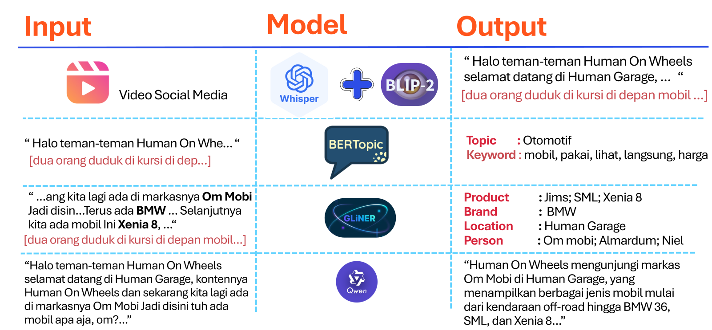
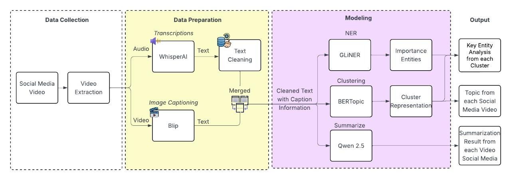
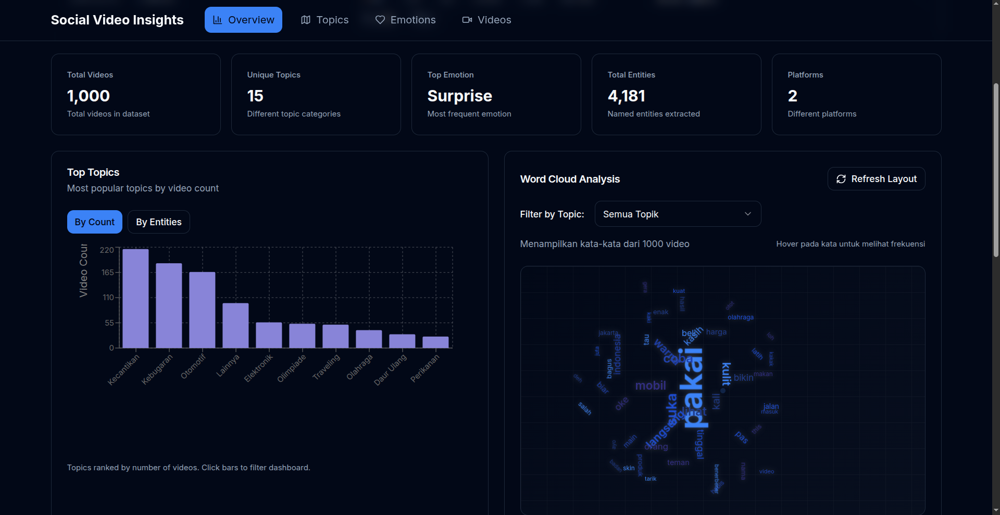

# 🎥 Social Video Intelligence · Satria Data 2025

> **End-to-end NLP pipeline & interactive analytics dashboard** for understanding public discourse through social-media video captions, from raw video URLs to actionable emotion and topic insights.

---

## 📌 Overview

This project was built for the **Satria Data 2025** national competition. The goal: extract meaning from social-media videos by automatically transcribing, clustering, and analyzing their content, then presenting all insights through a polished, fully-interactive web dashboard.

The system covers the entire lifecycle:

| Stage | What happens |
|---|---|
| **Ingestion** | Video URLs collected from Instagram & Google Drive |
| **Transcription** | Automatic captioning via speech-to-text |
| **Topic Modelling** | BERTopic clustering to discover latent themes |
| **Emotion Analysis** | Per-video emotion classification (Trust, Proud, Surprise, Neutral, …) |
| **NER** | Named-entity extraction (organisations, places, products) |
| **Summarisation** | LLM-assisted video content summaries |
| **Dashboard** | Next.js 14 interactive analytics web app |

### Input → Model → Output

Each video goes through a chain of models, with the output of one stage feeding the next:



| Step | Input | Model | Output |
|---|---|---|---|
| **Captioning** | Raw social-media video | Whisper + BLIP-2 | Speech transcript + visual caption |
| **Topic Modelling** | Combined text | BERTopic | Topic label + representative keywords |
| **NER** | Transcript text | GLiNER | Product, Brand, Location, Person entities |
| **Summarisation** | Full transcript | Qwen (LLM) | Concise natural-language video summary |

---

## 🏗️ Methodology

The pipeline is designed to be modular; each notebook corresponds to one stage and can be run independently.



---

## 🕸️ Best Network Result

The topic-entity network graph below illustrates the relationships discovered between dominant topics and the entity they evoke across the video corpus.


---

## 🌐 Interactive Dashboard

The final deliverable is a **client-side Next.js 14** web application that lets judges and stakeholders explore every insight interactively, with no backend required and all data loaded from a single CSV in the browser.

### Key pages

| Page | Highlights |
|---|---|
| **Overview** | KPI cards · Topic × Emotion heatmap · Top-topics bar chart · Auto-generated insight hints |
| **Topic Explorer** | Browsable topic cards with keywords, dominant emotion badge, and confidence score |
| **Emotion Insights** | Global distribution · Side-by-side topic comparison · Top NER entities per topic |
| **Video Browser** | Sortable, searchable, paginated data table with expandable rows and direct video links |

### Screenshots

<table>
  <tr>
    <td align="center">
      
      <br/><sub><b>Overview</b></sub>
    </td>
    <td align="center">
      
      <br/><sub><b>Video Browser and Insight</b></sub>
    </td>
  </tr>
</table>

---

## 🗂️ Repository Structure

```
.
├── notebooks/                  # Data pipeline notebooks (run in order)
│   ├── 01_Download_Video.ipynb       # Fetch videos from URLs
│   ├── 02_Captioning.ipynb           # Transcribe video audio
│   ├── 04_Clustering.ipynb           # BERTopic topic modelling
│   ├── 05_Summarize_Text.ipynb       # LLM-based summarisation
│   ├── 06_NER.ipynb                  # Named-entity recognition
│   └── 07_Visualisasi_NER_CLUSTER.ipynb  # Exploratory visualisations
│
├── dashboard/                  # Next.js 14 web application
│   ├── app/                    # App Router pages (Overview, Topics, Emotions, Videos)
│   ├── components/             # Reusable UI & chart components
│   ├── lib/                    # Data loading, aggregations, type definitions
│   ├── store/                  # Zustand global filter state
│   └── public/data.csv         # Processed dataset (served client-side)
│
└── assets/                     # Figures used in this README
```

---

## ⚙️ Tech Stack

### Pipeline (Python)
- `yt-dlp` / `gdown` : video acquisition
- `OpenAI Whisper` : automatic speech recognition
- `BERTopic` : neural topic modelling
- `Transformers` (HuggingFace) : emotion classification & NER
- `LangChain` / LLM API : text summarisation

### Dashboard (TypeScript / Node)
- **Next.js 14** (App Router) : framework
- **Tailwind CSS** + **shadcn/ui** : styling & components
- **Recharts** : data visualisations (heatmap, bar, donut)
- **TanStack Table** : advanced data grid
- **Zustand** : global filter state
- **Framer Motion** : micro-animations
- **PapaParse** : CSV parsing (client-side)

---

## 🚀 Running the Dashboard Locally

```bash
cd dashboard
npm install
npm run dev
```

Open [http://localhost:3000](http://localhost:3000).  
The app reads `/dashboard/public/data.csv` automatically on first load. No environment variables or backend required.

---

## 📊 Data Schema (CSV)

| Column | Type | Description |
|---|---|---|
| `Id` | int | Unique row identifier |
| `Video` | string | Source video URL |
| `Emotion` | string | Predicted emotion label |
| `Platform` | string | `instagram` / `google_drive` / `unknown` |
| `Topic_ID` | int | Cluster ID from BERTopic |
| `Topic_Label` | string | Human-readable topic name |
| `Topic_Keywords` | string | Comma-separated representative keywords |
| `Topic_Confidence` | float | Cluster membership probability (0–1) |
| `Summary` | string | LLM-generated video summary |
| `NER` | JSON string | Array of `{text, type}` named entities |

---

## ✨ Features at a Glance

- **Global filters**: Platform, Emotion, Topic, and free-text search propagate instantly across all pages
- **Heatmap interaction**: click any Topic × Emotion cell to slice the entire dashboard
- **NER cloud**: entity chips link directly to filtered video lists
- **Topic comparison**: side-by-side emotion breakdown for any two topics
- **Dark-first design**: premium dark theme with smooth Framer Motion transitions
- **Fully client-side**: works offline after the first CSV load; no API keys needed

---

<p align="center">Made with ❤️ for <strong>Satria Data 2025</strong></p>
